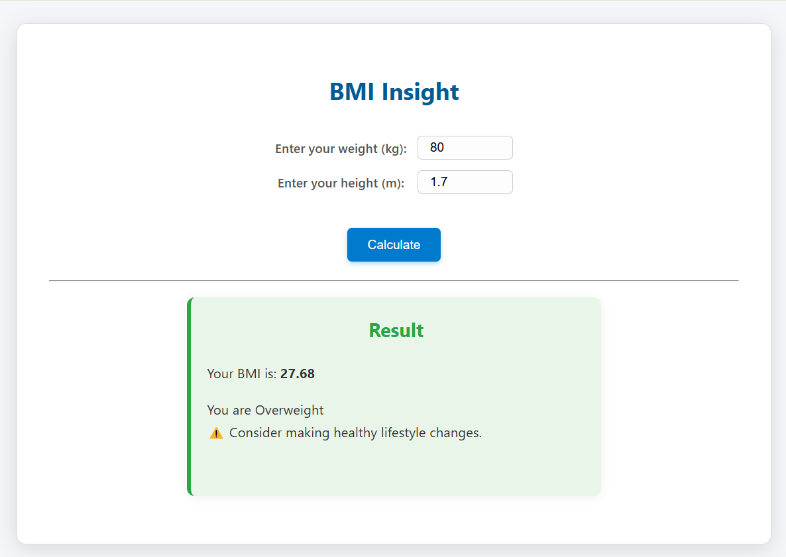

# 🧮 BMI Insight

A simple and responsive BMI (Body Mass Index) calculator built with **HTML**, **CSS**, and **JavaScript**. This tool helps users calculate their BMI, understand their health classification, and receive friendly advice based on the result.

---

## Table of Contents

- [Features](#features)
- [Screenshots](#screenshots)
- [Technologies Used](#technologies-used)
- [Project Structure](#project-structure)
- [How To Use](#how-to-use)
- [BMI Classification](#bmi-classification)
- [Future Plan](#future-plan)
- [Author](#author)
- [Contributing](#contributing)
- [License](#license)

---

## 🚀 Features

- ✅ Clean & responsive UI for desktop and mobile
- ✅ Validates input for errors (negative/empty values)
- ✅ Smart unit handling for grams and centimeters
- ✅ Instant BMI calculation and result display
- ✅ Personalized health classification:
  - Underweight
  - Normal
  - Overweight
  - Obese
- ✅ User-friendly messages and alerts
- ✅ Customizable and beginner-friendly code

---

## 📸 Screenshot



---

## 🛠️ Technologies Used

- **HTML5** – Semantic structure
- **CSS3** – Styling and responsive design
- **JavaScript** – Dynamic calculations and validations

---

## 📂 Project Structure

```
BMI-Insight/
│
├── index.html          # Main HTML page
├── style.css           # Styling for layout and responsiveness
├── script.js           # BMI logic and validations
└── screenshot.png      # Shot of UI's view
```

---

## 🧑‍💻 How to Use

1. **Clone this repository** or download the ZIP:
   ```bash
   git clone https://github.com/m-zahir-akbari/BMI-Insight.git
   ```

2. **Open `index.html`** in any modern web browser.

3. **Enter your weight (kg)** and **height (m)**.

4. Click the **"Calculate"** button.

5. View your **BMI result**, **classification**, and helpful notes.

---

## 📏 BMI Classification

| BMI Value       | Classification | Advice                                         |
|-----------------|----------------|---------------------------------------------   |
| Less than 18.5  | Underweight    | ⚠️ Consider consulting a healthcare provider.  |
| 18.5 – 24.9     | Normal         | 🎉 Keep up the good work! 💪                  |
| 25 – 29.9       | Overweight     | ⚠️ Consider making healthy changes.            |
| 30 and above    | Obese          | 🚨 It's important to consult a doctor.         |

---

## 🚀 Future Plan

- Change font styles or colors in `style.css`
- Add animations or sound feedback for interactivity
- Add unit toggles (e.g., lbs/inches to kg/m)
- Integrate health tips based on classification

---

## 💡 Author

Made with ❤️ by **Mohammad Zahir AKbari**

Feel free to reach out via GitHub or [LinkedIn](https://www.linkedin.com/in/m-zahir-akbari786)!

---

## 🤝 Contributing

Pull requests, feedback, and suggestions are welcome!

1. Fork the repo
2. Create your feature branch (`git checkout -b feature/my-feature`)
3. Commit your changes (`git commit -m 'Add new feature'`)
4. Push to the branch (`git push origin feature/my-feature`)
5. Open a pull request 🚀

---

## 📃 License

This project is open source and available under the [MIT License](LICENSE).


